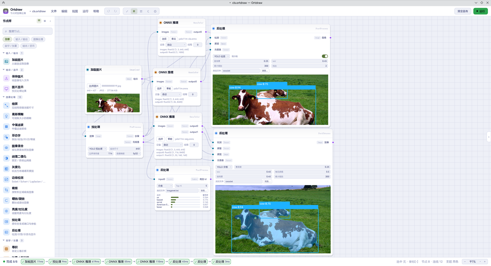

# Ortdraw

基于节点的深度学习图像处理工具（原型）。使用 Qt 6 / QML 构建可拖拽的节点图编辑器，
底层集成 OpenCV 与 ONNX Runtime（经自研 onnx_engine SDK），可运行深度学习推理节点。

> 当前状态：**节点图编辑与执行引擎可用**（创建、连线、移动、缩放、删除、撤销/重做、
> 主题切换、属性编辑、minimap）；内置图像节点通过 OpenCV 进行实际运算，结果缓存并预览；
> ONNX 推理节点（预处理 → 推理 → 后处理任务链）已接入；图可保存为 `.ortdraw` 文件。



## 界面

- **主题**：默认亮色主题，工具栏 `☾ / ☀` 按钮切换亮/暗，全界面即时生效。
- **节点库抽屉**：列表 / 网格视图切换、搜索、分类筛选、分组折叠，点击条目或 `＋` 添加节点。
- **可折叠面板**：节点库与属性面板均可折叠；窄屏自动收起（宽度 `< 1180` 收起属性，`< 960` 收起节点库）。
- **画布**：背景可切换为 空白 / 点阵 / 网格（工具栏 ▦ 循环切换），平移 / 缩放，`运行 / 停止（F5）、适应视图`（`Ctrl+0`）。
- **Minimap**：右下角缩略图，点击可定位视图。
- **右键上下文菜单**：针对节点 / 连线 / 画布提供不同操作（复制、断开、置顶、删除、添加节点、适应视图、清空画布）。
- **属性面板**：显示所选节点的名称（可编辑）、类型、输入/输出端口、位置与描述，并可删除节点或连线。

## 功能

- 节点图编辑：从侧栏添加节点，拖拽移动，右下角缩放。
- 端口连线：从输出端口按住拖拽到输入端口释放即可连线（也可从输入端口反向拖到输出端口）；
  可在设置中切回点击方式。连接过程中显示跟随指针的预览线；
  自动拒绝自连、类型不匹配、重复连接与成环。
- 连线渲染：支持 Spline/Linear/Straight 三种渲染模式（默认 Spline，可在设置中切换），点击连线可选中。
- 删除与撤销：Delete 删除选中的节点/连线；`Ctrl+Z` 撤销，`Ctrl+Y` 重做。
- 多选：`Ctrl+点击` 节点可多选，批量删除；**空白处按住左键拖动可拉选（框选）多个节点**
  （与节点相交即选中，`Ctrl+拖动` 追加选择；平移模式下按住 `Shift` 拖动也可拉选）；
  拖动其中**已选中**的节点即为**整组移动**（相对位置保持，一次 `Ctrl+Z` 整组还原）；
  多选/右键菜单等可在设置中开关。
- 图文件：新建 / 打开 / 保存（`Ctrl+N` / `Ctrl+O` / `Ctrl+S`，菜单「文件」）使用**系统原生文件对话框**
  （KDE/Dolphin 等桌面环境），文件格式为 `.ortdraw`（JSON），保存时自动补全扩展名。

## 执行引擎

- **运行**：顶栏右上角的「运行 / 停止」按钮触发整图求值。求值在**后台线程**按拓扑序进行，
  不阻塞界面；运行中按钮变为「停止」，点击可取消。状态栏左侧实时显示引擎状态
  （`就绪` / `运行中…` / `完成` / `失败` / `已取消`）。
- **实际运算**：`ImageLoad` 节点内的「选择图片」按钮通过**系统原生文件对话框**选图并读取为图像；
  `Resize`（线性缩放）、`Blur`（高斯模糊）、`Threshold`（灰度二值化）、`Conv`（`cv::filter2D` 卷积）
  等 15 种图像节点均调用 **OpenCV** 实际运算。
- **真实预览**：`ImageShow` 与各节点的缩略图显示该节点最近一次执行的**真实结果**；
  尚未产生结果时显示占位图。
- **错误处理**：节点执行失败时，卡片右上角显示红点，悬停红点显示错误文本；状态栏变为「失败」。
  单个节点失败不会中断其余可求值的分支（其上/下游按依赖跳过）。
- **拓扑求值**：引擎对图做快照后在线程内用 Kahn 算法做拓扑排序，解析每个节点的输入
  （沿入边取上游缓存输出），逐节点调用执行器；结果图像经队列信号回到主线程写入缓存，
  QML 通过 `image://nodeimage/<uuid>` 读取。
- **运行队列**：状态栏实时显示本次运行的节点队列（就绪 / 运行中 / 完成 / 失败 / 跳过 / 取消），
  多张互不相连的图（多 DAG）自动分组建组，可用组选择器过滤查看。
- **SDK**：节点执行抽象为 `NodeExecutor`（执行接口）与 `NodeRegistry`（类型 → 执行器注册表），
  内置执行器在启动时注册；`GraphExecutor` 负责拓扑、后台求值与错误传播；`ImageStore`
  （`QQuickImageProvider`）缓存结果图像。

### ONNX 推理

- **独立 SDK**：`onnx_engine/` 是基于 ONNX Runtime 的共享库，`Runtime` 单例管理模型会话，
  带 LRU 缓存（默认 4 个模型 / 1GiB）、按 mtime/size 自动失效、并发去重加载；
  `Session::run` 返回 `std::expected`，支持 CPU 与 CUDA（缺 cuDNN 依赖时自动回退 CPU）。
- **张量互转**：`engine/onnx/OnnxTensorConvert.hpp` 负责 `cv::Mat ↔ Tensorvia Tensor` 双向转换，
  覆盖 NCHW/NHWC、fp32/fp16/bf16 与多种归一化。
- **任务框架**：`engine/tasks/` 用 `TaskSpec`（参数描述 + compute）描述可复用任务，
  `PreProcessRegistry` / `PostProcessRegistry` 注册内置任务，节点 UI 依据参数描述**自动生成控件**：
  - `PreProcess` 节点：标准预处理（布局 / 通道 / dtype / 归一化可选）与 YOLO letterbox；
  - `OnnxInfer` 节点：选择 `.onnx` 模型，自动识别输入输出张量信息；
  - `PostProcess` 节点：`yolo_detect`（YOLO 检测，类内 NMS）、`yolo_segment`（分割）、
    `classify`（softmax Top-K，结果送入节点显示通道）。
  - 预处理输出的几何元信息（原图尺寸 / 缩放 / 填充）供后处理把框与掩码映射回原图坐标。
- **类别文件**：检测 / 分割 / 分类后处理均可加载类别文件（`.txt`，UTF-8，每行一个类别、
  行号即类别 id，如 COCO 80 类 / ImageNet-1k 1000 类）。加载后图上标签与分类显示
  由 `id:分数` 变为「名称 分数」（如 `person 0.91`）；未加载或 id 越界时回退 id 显示。
- **`Tensor` 节点**：生成张量数据（如 `Conv` 所需的卷积核），打通张量类型端口。

### 端口类型

端口数据类型收敛为 `Image / Tensor / Number / Bool / Any`（原 `Float` 等数值类型统一为 `Number`；
`Any` 可与任意类型连接）。张量端口使用 **Tensorvia** 的 `via::Tensor`。

### 当前限制

- **手动运行**：默认为手动运行（顶栏「运行 / 停止」或 `F5`）；可在
  设置 → 性能 → 执行 中开启「**自动重算**」：开启后修改参数 / 连线 / 增删节点约 0.3 秒
  自动重新求值（连续变更会合并为一次），手动运行仍然可用。
- `Conv` 需要**张量（Tensor）类型的卷积核输入**，可用 `Tensor` 节点生成卷积核数据。
- ONNX 模型文件需自备（如 `yolo11n.onnx`），放入 `models/` 目录（该目录被 git 忽略）；
  模型缺失时相关测试自动跳过。

## 设置

- **入口**：顶栏最右侧的齿轮按钮 `⚙`（标题「设置」）；或菜单「编辑 → 设置…」。
- **对话框**：全窗口浮层，分左侧分类与右侧设置行，支持按标签搜索。改动**即时生效**：
  每个控件直接读写 `Settings` 并立即作用于界面；「保存」只调用 `Settings.sync()` 落盘，
  「取消」/`Esc`/点击遮罩会回滚到打开对话框时的快照，底部另有「恢复默认」。
- **分类（8 个）**：外观、画布、节点、连线、交互、性能、快捷键、关于；
  其中「快捷键」「关于」为只读信息页。
- **持久化位置**：`QSettings`（IniFormat，UserScope，组织/应用名 `Ortdraw`/`Ortdraw`），
  Linux 下即 `~/.config/Ortdraw/Ortdraw.ini`；测试可用环境变量 `ORTDRAW_SETTINGS_PATH`
  指定 INI 文件以隔离真实配置。析构与「保存」时均会落盘。
- **已接入（修改即时生效）**：主题与强调色、画布背景（空白/点阵/网格）与吸附/间距、空格平移、适应视图边距、
  缩放范围、节点预览/缩略图高度/高度自适应/端口类型标签/文字渲染/圆角、
  连线渲染模式/线宽/中点显示/悬停高亮、Minimap 刷新率、抗锯齿、连线方式（拖拽/点击）、
  Ctrl 多选节点（关闭后 Ctrl+点击不再多选/切换选择）、启用右键菜单（关闭后右键不弹出上下文菜单）、
  自动重算（开启后参数/连线/节点变更约 0.3 秒自动重新求值）。
- **占位（界面标注「即将支持」，控件禁用）**：界面密度、语言、删除确认、
  自动断开旧连线、异步图像加载。

## 目录结构

```
include/            头文件（大部分实现为 header-only）
  node/             节点基类与 19 种具体节点（15 种图像 + Tensor + 3 个 ONNX 任务节点）
  port/             端口
  utils/            DAGraph（邻接表 + 环检测）、Edge（贝塞尔曲线）、Snapshot、QueueGroups
  command/          命令模式 undo/redo
  engine/           执行引擎 SDK（NodeData / NodeExecutor / NodeRegistry / GraphExecutor / ImageStore）
    executors/      内置执行器（与 node/ 一一对应，OpenCV 实际运算）
    tasks/          任务框架（TaskSpec）与预处理 / 后处理任务注册表
    onnx/           cv::Mat ↔ Tensorvia Tensor 转换（布局 / dtype / 归一化）
  Theme.h           Theme 单例（颜色/亮暗主题，读写 Settings）
  Settings.h        Settings 单例（QSettings 持久化偏好设置）
  NodeManager.h     全局单例，QML 事件入口
  PaintBoard.h      画板（绘制连线）
src/main.cpp        程序入口
onnx_engine/        基于 ONNX Runtime 的独立共享库（Runtime / Session、LRU 会话缓存）
qml/                界面（主窗口与各组件）
  palette/          节点库（NodeCatalog / NodePalette / PaletteItem）
  canvas/           CanvasArea、Minimap
  chrome/           TopBar、StatusBar、ContextMenu
  inspector/        Inspector（属性面板）
  settings/         SettingsDialog（设置对话框）
  node/NodeCard.qml 节点卡片
tests/              Qt Test 单元测试
assets/             图标、贴图与 README 截图
docs/               设计与实施文档
```

## 依赖

- CMake ≥ 3.30
- 支持 C++23 的编译器（GCC 13+ / Clang 16+）
- Qt 6.8+（Core、Gui、Quick、Widgets、Test）
- OpenCV 4/5
- **Tensorvia**（张量库；CMake 目标 `Tensorvia::tensorvia`，头文件 `<tensorvia/core/tensor.h>`）
- **ONNX Runtime**（默认查找 `/usr`，可用 `-DONNXRUNTIME_ROOT=<prefix>` 指定安装前缀）

## 开发辅助

`./bin/main --demo` 会创建两个示例节点（加载图片、图片显示），便于无鼠标环境截图/验证。

`assets/` 下附三条示例流水线图（需自备模型于 `models/`，图片与类别文件按图内路径准备）：
`det.ortdraw`（检测）、`seg.ortdraw`（分割）、`cls.ortdraw`（分类），打开即可看到完整
「加载图片 → 预处理 → ONNX 推理 → 后处理」链路与类别名称显示。

## 构建

```bash
cmake -S . -B build
cmake --build build -j4
```

可执行文件输出到 `bin/main`。

## 运行

```bash
./bin/main
```

## 测试

```bash
cmake -S . -B build -DORTDRAW_BUILD_TESTS=ON   # 测试默认不构建，需显式开启
cmake --build build -j4
ctest --test-dir build --output-on-failure
```

测试使用 Qt Test，并通过 `QT_QPA_PLATFORM=offscreen` 在无显示环境运行。

## 已知限制

- 已实现 19 种节点，均通过执行引擎实际运算；参数在节点内编辑：
  - 加载图片 ImageLoad：输出 图像(Image)
  - 图片显示 ImageShow：输入 图像(Image)
  - 保存图片 ImageSave：输入 图像(Image)
  - 图像处理：Resize（缩放）、Blur（高斯模糊）、Median（中值滤波）、Morphology（形态学）、
    Blend（混合）、Threshold（二值化）、Gray（灰度）、EdgeDetect（边缘检测）、Crop（裁剪）、
    FlipRotate（翻转旋转）、BrightnessContrast（亮度对比度）、Conv（卷积，需 Tensor 卷积核）
  - 张量 Tensor：输出 张量(Tensor)（如卷积核）
  - ONNX 任务链：PreProcess（预处理）→ OnnxInfer（推理）→ PostProcess（后处理）
- 默认为手动运行；开启「自动重算」后变更约 0.3 秒自动重新求值（详见「执行引擎 → 当前限制」）。
- 删除的节点对象会保留在内存中直到画布销毁（撤销所需，编辑器规模下可忽略）。

## 后续路线

1. 更多节点类型：张量生成与运算节点、张量结果预览。
2. 异步图像加载与更大的图执行性能优化。
3. 后处理任务扩展（更多检测 / 分割 / 关键点头解析）。
